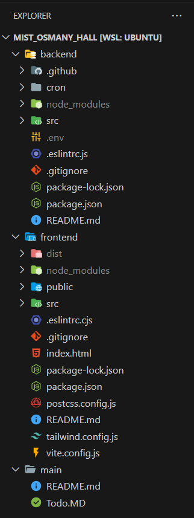

# Sohoz Meal Project Setup Guide

This guide provides step-by-step instructions for setting up the Sohoz Meal project, including cloning the repository, setting up the frontend and backend environments, and running the project locally.

## Cloning the Repository and Initial Setup

1. Create a new directory for the project and navigate into it:
    ```bash
    mkdir MIST_OSMANY_HALL
    cd MIST_OSMANY_HALL
    ```

2. Clone the repository into the newly created directory:
    ```bash
    git clone https://github.com/Naiem890/sohozmeal.git
    ```

3. Copy the repository into separate frontend and backend directories:
    ```bash
    cp -r sohozmeal frontend
    cp -r sohozmeal backend
    mv sohozmeal main
    ```

4. (Optional) Open in Visual Studio Code:
    ```bash
    code .
    ```

## Frontend Setup

1. Navigate to the frontend directory:
    ```bash
    cd frontend
    ```

2. Checkout the production branch for frontend:
    ```bash
    git checkout sohozmeal_frontend
    ```

3. Use the development branch for ongoing development:
    ```bash
    git checkout sohozmeal_frontend_dev
    ```

4. Install dependencies and start the development server:
    ```bash
    npm install
    npm run dev
    ```

## Backend Setup

1. Navigate to the backend directory:
    ```bash
    cd backend
    ```

2. Checkout the production branch for backend:
    ```bash
    git checkout sohozmeal_backend
    ```

3. Use the development branch for ongoing backend development:
    ```bash
    git checkout sohozmeal_backend_dev
    ```

4. Create a `.env` file in the project root and configure environment variables:
    ```plaintext
    # General variables
    NODE_ENV=production
    PORT=5000
    API_KEY=YOUR_SMS_PROVIDER_SERVICE_API_KEY
    SENDER_ID=YOUR_SMS_PROVIDER_SENDER_ID
    SALT_ROUNDS=YOUR_SALT_ROUND_VALUE
    JWT_SECRET=YOUR_SECRET

    # MongoDB variables
    DB_URI_CLOUD=YOUR_MONGODB_ATLAS_URI
    DB_URI_LOCAL=mongodb://localhost:27017/sohozMeal
    ```

5. Install dependencies and start the development server:
    ```bash
    npm install
    npm run dev
    ```
###
### After completing the setup, your folder structure should resemble the following:


## Conclusion

Follow these instructions to set up the Sohoz Meal project for frontend and backend development. Ensure correct branch selection and dependency installation before starting the development server.
